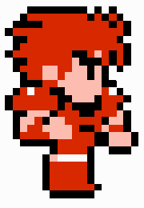
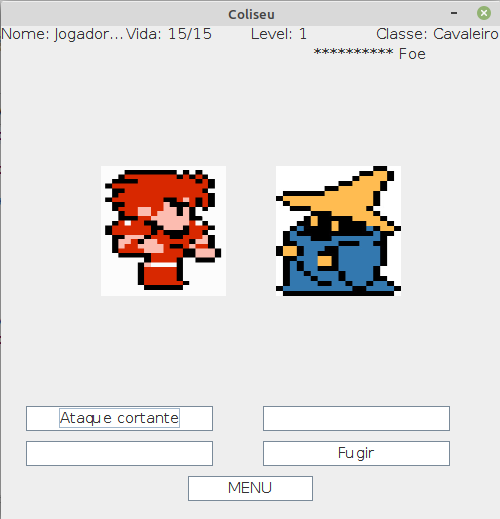

<h1 align="center">
    
</h1>

<h2 align="center">
  Coliseum, a Java Game Project
</h2>

  

  
  
  

  

  

  <a href="#about">About</a>&nbsp;&nbsp;&nbsp;|&nbsp;&nbsp;&nbsp;
  <a href="#authors">Authors</a>&nbsp;&nbsp;&nbsp;|&nbsp;&nbsp;&nbsp;
  <a href="#running-the-application">Running</a>&nbsp;&nbsp;&nbsp;|&nbsp;&nbsp;&nbsp;
  <a href="#changing-game-characteristics">Changing Characteristics</a>&nbsp;&nbsp;&nbsp;|&nbsp;&nbsp;&nbsp;
  <a href="#built-with">Built with</a>&nbsp;&nbsp;&nbsp;|&nbsp;&nbsp;&nbsp;
  <a href="#contributing">Contributing</a>&nbsp;&nbsp;&nbsp;|&nbsp;&nbsp;&nbsp;
  <a href="#license">License</a>

 

  

## About

A game project developed for <strong>learning and entertainment</strong> purposes, more specifically, applying object oriented programming concepts using <strong>JAVA</strong> language. The game has a closed arena style, with a fighting style inspired by pokemon games. It is also worth noting that the project has texts and class/atributes/methods names in Portuguese.

* Last updated: 03-2016
* Version: 0.3
* Status: discontinued
* Main problem: slow animations and unbalanced gameplay
* Purpose: learning object oriented programming

Observation: the execution is a bit slow. We believe it might be related to the use of the Observer pattern, but we haven't looked upon that, since the project has been discontinued.

## Authors

* Adolfo Santos Cardoso
* Eric Ferreira Schmiele
* Gabriel Henrique Giarolla Silveira

## Running the application

Execute, with your prefered JAVA running program, the class GUI or GUI_2 (depending on your screen resolution).

## Changing Game Characteristics

* The only diference between difficulty settings is the level gap between the player and the enemy (easy (fácil): player > enemy; meddium (médio): player = enemy; difficult (difícil): player < enemy);
* Attack hit/miss rate is determined by stats and die rolls, if it is necessary to change the hit/miss rate, simply change the lines with the commentary `//calculo_de_ataque`;
* Damage depends on the player/enemy level, if it is necessary to change the damage calculation, simply change the lines with the commentary `//valor_de_ataque`;
* There is a culculation for dropping an item from a defeated enemy, if its is necessary to change this calculation, simply change the lines with the commentary `//item_deixado`;
* The winning condition is reaching level 10, if it is necessary to change this condition, simply change the lines with the commentary `//condicao_de_vitoria`;
* There is also a calculation for leveling up, if it is necessary to change this calculation, simply change the lines with the commentary `//experiencia_adquirida`;

## Built with

* [JAVA](https://www.java.com)

<!-- ## Layout

 You can download the layout (`.sketch`) using [this link](.github/DevRadar.sketch).

To open it in any SO, use [Figma](https://figma.com). -->

## Contributing

* Fork this repository;
* Create a branch with your feature: `git checkout -b my-feature`;
* Commit your changes: `git commit -m 'feat: My new feature: <description>'`;
* Push it to your branch: `git push origin my-feature`.

After merging your pull request, your branch can be deleted;

## License

This project uses the MIT license. Read [LICENSE](LICENSE.txt) for details.
